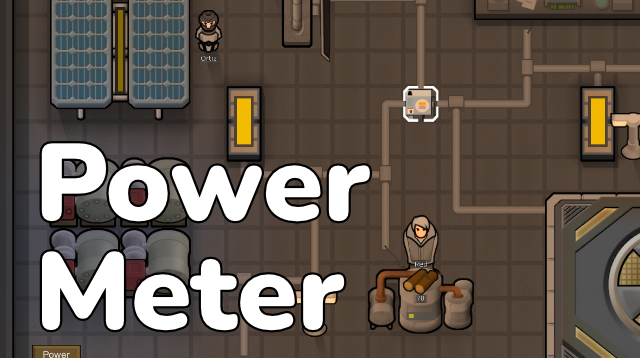
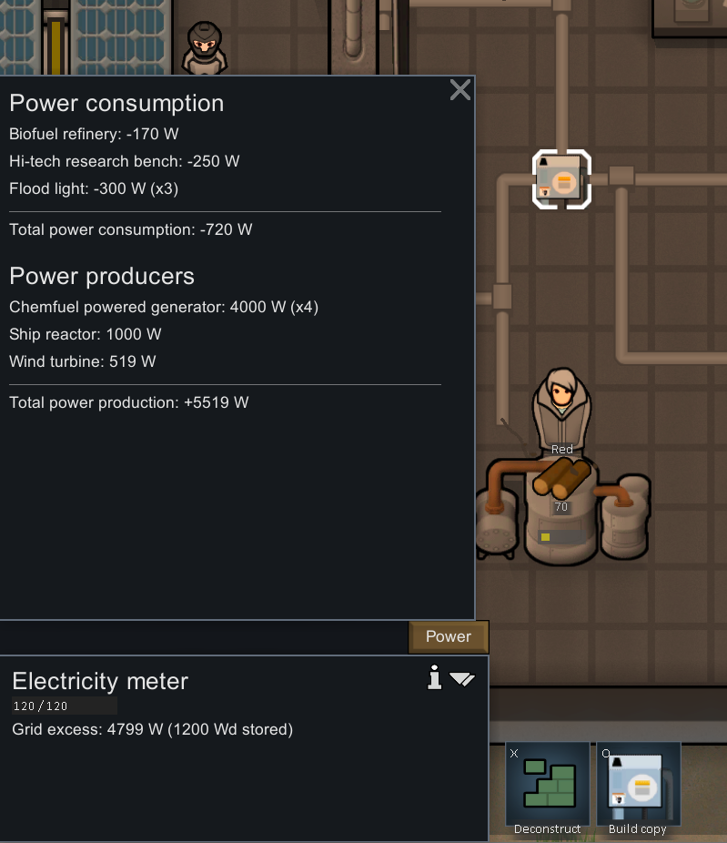

# Rimworld Electricity Meter Mod

Have you ever thought "What is using all my power?!"

This mod introduces a power meter, that once attached to a power grid it will show you a breakdown of the power usage and generation of that grid.

It will show you the total power cost, the total power generation, and a breakdown of each power generator and consumer in the grid.



This is a mod designed for the Rimworld 1.6 base game.

# Features:
1. ***Energy cost of each active power consumer***: Shows a breakdown of the energy cost for each active power consumer in the grid.
2. ***Energy generation of each active power generator***: Shows a breakdown of the energy generation for each active power generator in the grid.
3. ***Requires research***: You must research the "Electricity Meter" technology to unlock the ability to build the electricity meter.
4. ***Does not require power***: The electricity meter does not require power to function.
5. ***Must be placed on a power grid***: Simplifies the process of finding out which power grid is consuming or generating power.

# Building & compiling from the source:
This was compiled with Dotnet 9.0+ make sure you have it installed or a later version.

Clone this repository into your `steamapps/common/RimWorld/Mods` folder.

### Using the command line:

```shell
make
```

Or if you don't have `make` installed, you can run:

```shell
dotnet build .vscode
```

### Using Visual Studio Code:
Open this repository in Visual Studio Code, and use Ctrl+Shift+B to build the assemblies for the mod.

# Steam URL:
<TODO>

# Repository:
View the source code, contribute, or report issues on GitHub:
https://github.com/JalapenoLabs/rimworld-electricity-meter

# License:
This mod is licensed under the [MIT License](https://opensource.org/licenses/MIT)

# Author:
Alex Navarro
alex@jalapenolabs.io

Patreon: https://www.jalapenolabs.io/patreon
