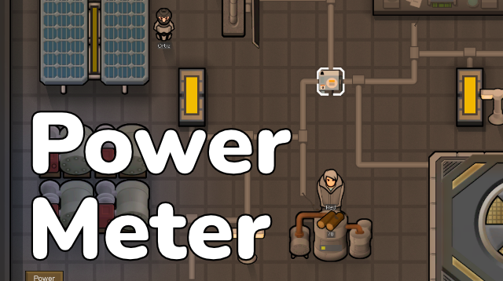
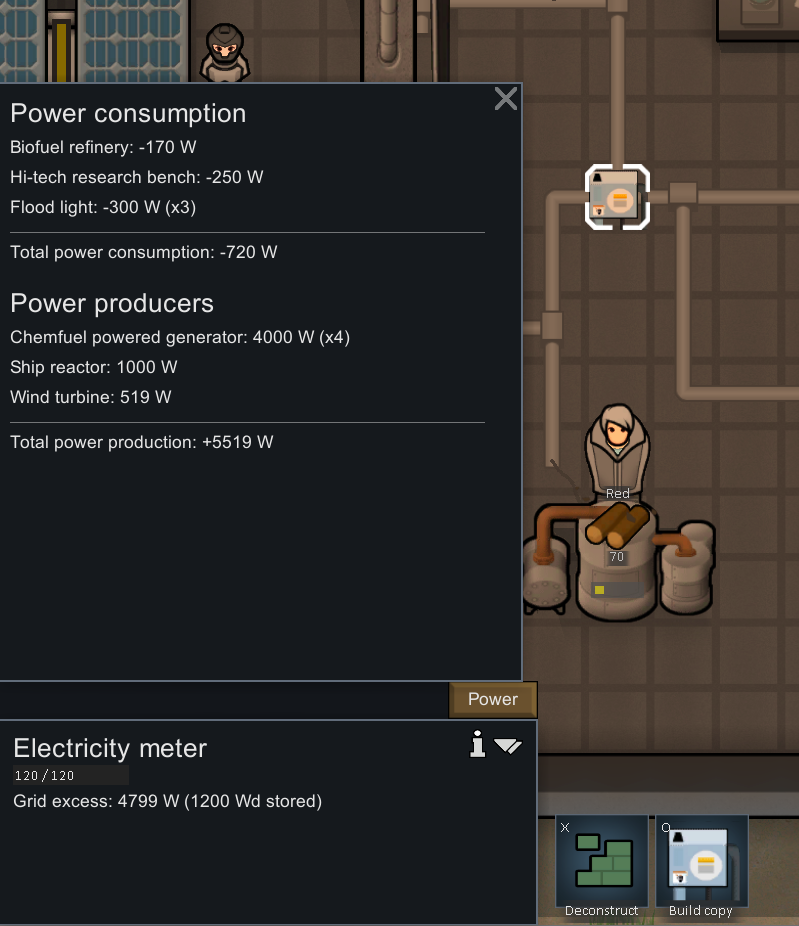

# Rimworld Electricity Meter Mod

Have you ever thought "What is using all my power?!"

Introducing a researchable power meter!

Once it's attached to a power grid, it will show you a full breakdown of:
- All power consumption items on the grid
- All power generation items on the grid



This is a mod designed for the Rimworld 1.6 base game.

# Features:
1. ***Energy cost of each active power consumer***: Shows a breakdown of the energy cost for each active power consumer in the grid.
2. ***Energy generation of each active power generator***: Shows a breakdown of the energy generation for each active power generator in the grid.
3. ***Requires research***: You must research the "Electricity Meter" technology to unlock the ability to build the electricity meter.
4. ***Does not require power***: The electricity meter does not require power to function.
5. ***Must be placed on a power grid***: Simplifies the process of finding out which power grid is consuming or generating power.

# Building from source

This mod is part of the [rimworld-mods monorepo](https://github.com/JalapenoLabs/rimworld-mods), which provides the shared RimWorld DLLs and build tooling. **You must clone the monorepo — not this repository directly — in order to build.**

### Prerequisites
- [.NET 9.0+](https://dotnet.microsoft.com/download)
- [Mage](https://magefile.org/) — `go install github.com/magefile/mage/mage@latest`

### Steps

```shell
git clone --recurse-submodules https://github.com/JalapenoLabs/rimworld-mods
cd rimworld-mods
mage build electricity-meter
```

Or with Make:

```shell
make -C mods/electricity-meter
```

# Steam URL:
https://steamcommunity.com/sharedfiles/filedetails/?id=3542488017

# Repository:
View the source code, contribute, or report issues on GitHub:
https://github.com/JalapenoLabs/rimworld-electricity-meter

# License:
This mod is licensed under the [MIT License](https://opensource.org/licenses/MIT)

# Author:
Alex Navarro
alex@jalapenolabs.io

Patreon: https://www.jalapenolabs.io/patreon
